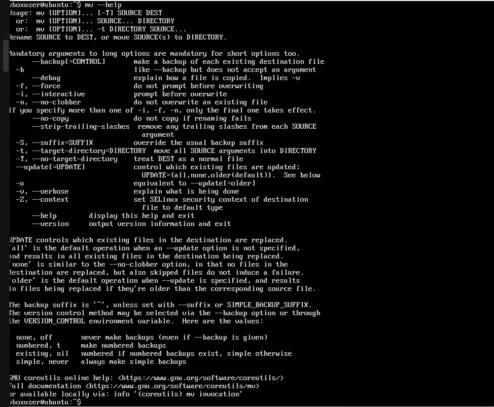
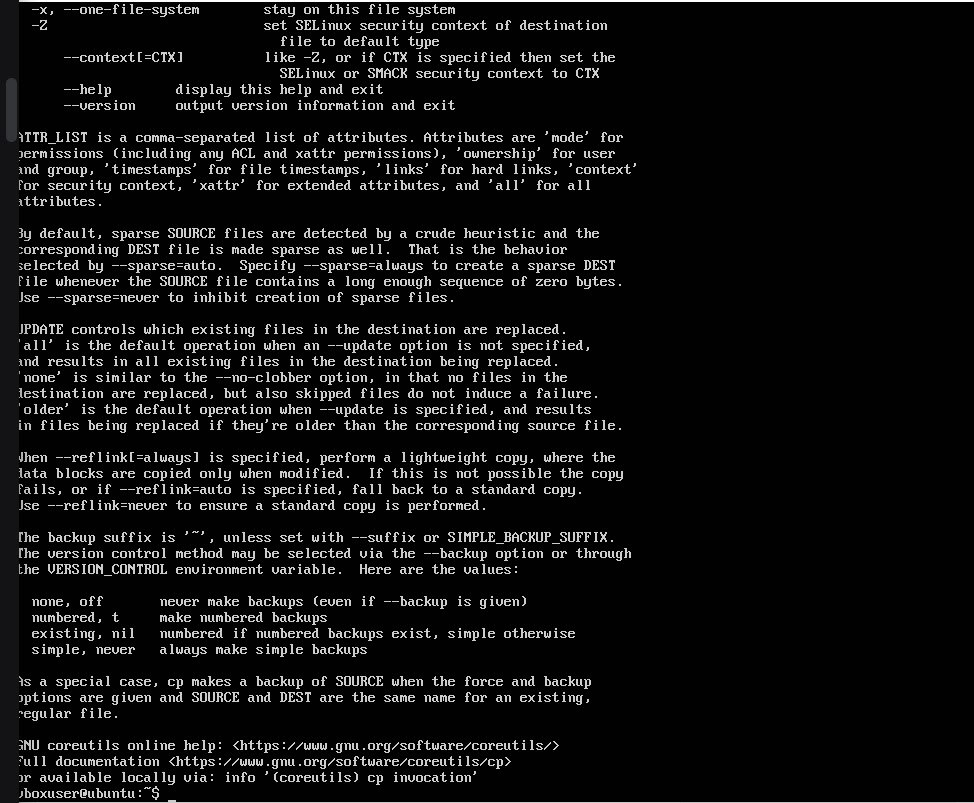
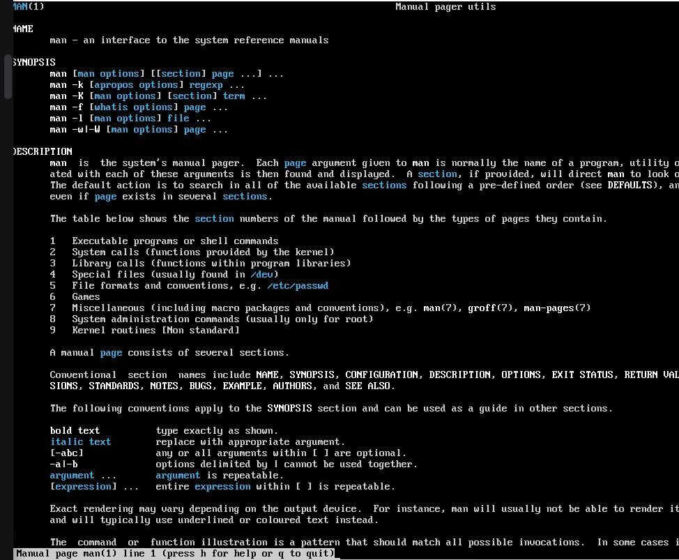
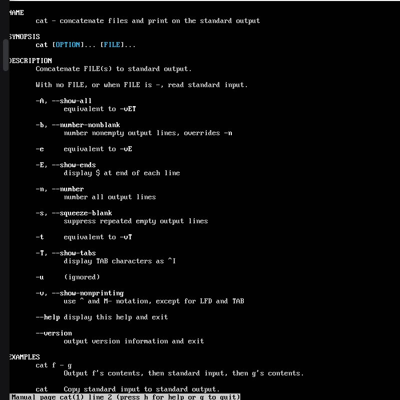

# Домашнє завдання №1
Тема: Базові команди Linux, робота з документацією та сценаріями

Примітка: Робота виконувалася на дистрибутиві Ubuntu Server. Оскільки це серверна версія, домашній каталог користувача (/home/boxuser) за замовчуванням порожній. Усі необхідні папки були створені вручну.

---

## Завдання 1. Базові команди

1. Перегляд каталогу: ls ~
2. Перехід у Downloads: mkdir Downloads && cd Downloads
3. Створення файлу: > new_file.txt
4. Перегляд вмісту: cat new_file.txt
5. Абсолютний шлях: cd /home/boxuser
6. Відносний шлях: cd ~ 


---

## Завдання 2. Робота з документацією

### Результати виконання команд:

1. man ls — детальна інструкція до команди списку файлів.
2. help cd — довідка для вбудованої команди зміни каталогу.


3. man cat — опис команди для виводу вмісту файлів.


4. man man — документація самого інтерфейсу системних посібників.


5. cp --help — стисла довідка для команди копіювання.


6. mv --help — перелік ключів для переміщення та перейменування.


### Відповіді на питання:

* Який ключ ls показує приховані файли?
    Ключ -a (all).
* Який ключ у cat нумерує рядки?
    Ключ -n (number).
* Чим відрізняються man і --help?
    man — повна документація в окремому вікні, --help — коротка довідка в консолі.

---

## Завдання 3. Міні-сценарій

```bash
# 1. Створення та перехід у каталог
mkdir -p ~/lab_work && cd ~/lab_work

# 2. Створення файлу без touch
> notes.txt

# 3. Перегляд списку файлів
ls -la

# 4. Перехід у корінь системи
cd /

# 5. Повернення назад
cd -

# 6. Перевірка шляху та виклик документації
pwd
man pwd
